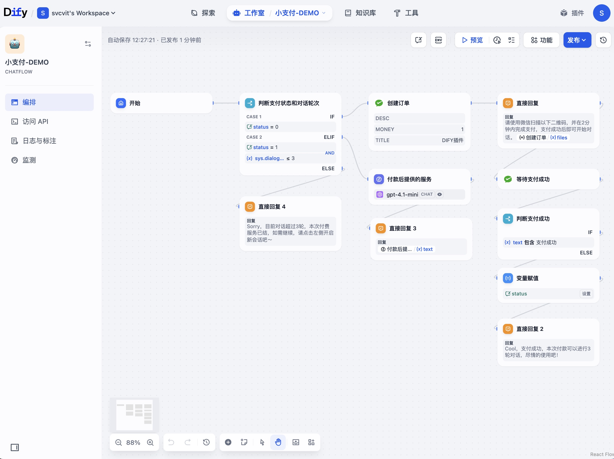
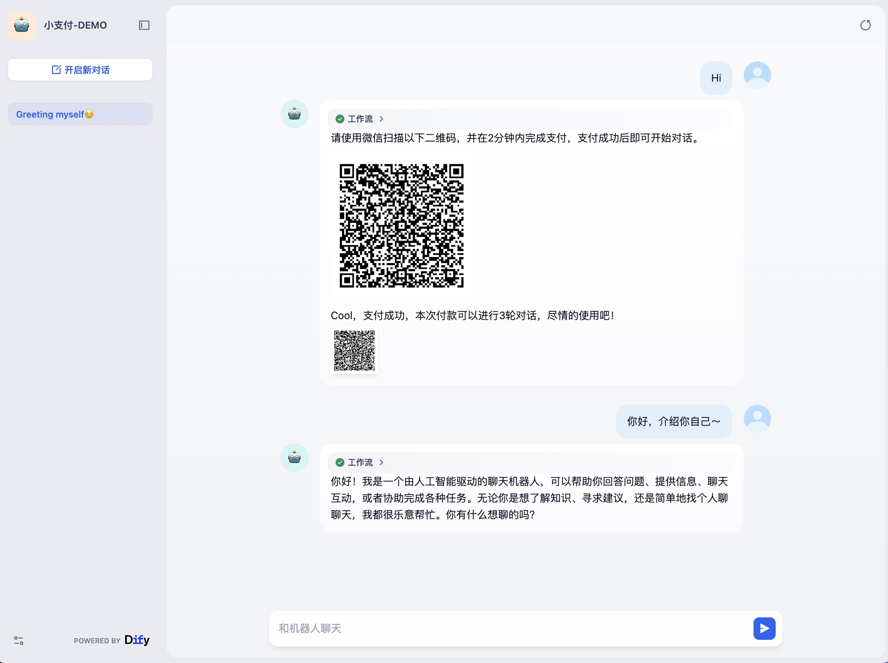

## Small Pay

**Co-Author:** [svcvit](https://github.com/svcvit)、[hjlarry](https://github.com/hjlarry)  
**Version:** 0.0.2  
**Type:** tool  
**Repo&Issues:** [https://github.com/hjlarry/dify-plugin-small_pay](https://github.com/hjlarry/dify-plugin-small_pay)

### 功能 / Features
这是为个人开发者的工作对话流微信收款服务，让有价值的流程开发者也可以实现变现。
This is a WeChat payment service for workflow developers, enabling individual developers to monetize their valuable workflow creations.

### 特性 / Highlights
- 微信支付，支持信用卡付款  
  WeChat Pay, supports credit card payments
- **15%** 的平台服务费  
  **15%** platform service fee

### 开始

前往Github，下载[chatflow](https://github.com/hjlarry/dify-plugin-small_pay/blob/main/_assets/chatflow-DEMO.yml)示例，导入即可使用。
Go to Github, download the [chatflow](https://github.com/hjlarry/dify-plugin-small_pay/blob/main/_assets/chatflow-DEMO.yml) example, and import it to start using.

